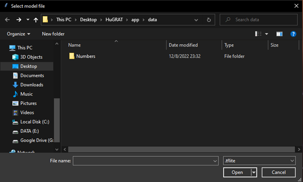

# Where to get HuGRAT?
The program package can currently be found at https://drive.google.com/file/d/1vhbEHol8VH8njq0G-7ADXjFdiJB_d33g/view?usp=sharing 
Click Download to download the zip file and save it where you would like.

 
Extract the zip file and move the contents where you would like.  Once extracted, it should look like this:
 

The program repository can be found at https://github.com/DSHABURA/HUGRAT 
You can download the repository for use through an IDE or console using Python.

# Starting HuGRAT
If you are using the packaged program from the zip file, double click START.  If you are using the console / IDE version from the repository, start from a terminal with the path to project folder.  Everyone’s path will be different, so the picture below is just an example.  Please note, you will need an IDE, Python 3.9 (This project is written in 3.9.13), loaded before starting the program.

If you are running the packaged program, simply open the folder and double click the START shortcut.

 
Once the program has started, you should see the Home screen shown here.

 

# Using HuGRAT: Saving a Gesture Set
To record a new set of gestures, click Create New Model.

 
When you hand is visible in the screen, you should see traces across that hand.  This program is designed to record only one hand, so it will be easier if the other hand is off screen.
To record a gesture, type what you would like the gesture to be called into the text field above the capture button, and then either press F1 or click the Capture button, whichever is easier for you with your other hand.  You can press or click a few times if you like.  When the gesture is read back to you, what you typed in is what it will be read back to you when translating the gesture.  You can record several gestures in the set, just change the label in the text field and click Capture.  When you are finished, click Finish.  You will be presented with the next screen shown below.  To cancel, click Home.

 
To save the set of gestures, type in what you would like to name the set in the field over the Start Training button and then click Start Training.  To cancel, click Home.  When the training is in progress, please be patient.  The time it takes will depend on the number of gestures and the capabilities of the computer.  Once the training is complete, you will see the following:

 
It is recommended that the model is saved in HuGRAT\app\data\Numbers as shown above.  Click the Save button to continue and you will be brought back to the Train New Model screen.  Click Home to go back to the home screen.

#Using HuGRAT: Translating Gestures
From the Home screen, click the Begin Translation button.  You will see this screen:

 
Navigate to where you saved the gesture set you would like (the default is recommended) and then open the folder with you gesture set’s label.  Then, open the .tflite file.
 
 
 
Once you see the camera video come up, you are ready to start translating your gestures.  Hold up your hand and the HuGRAT will tell you what you saved it as.  Once you are done, you can exit the program or click Home to go back to the Home screen.
